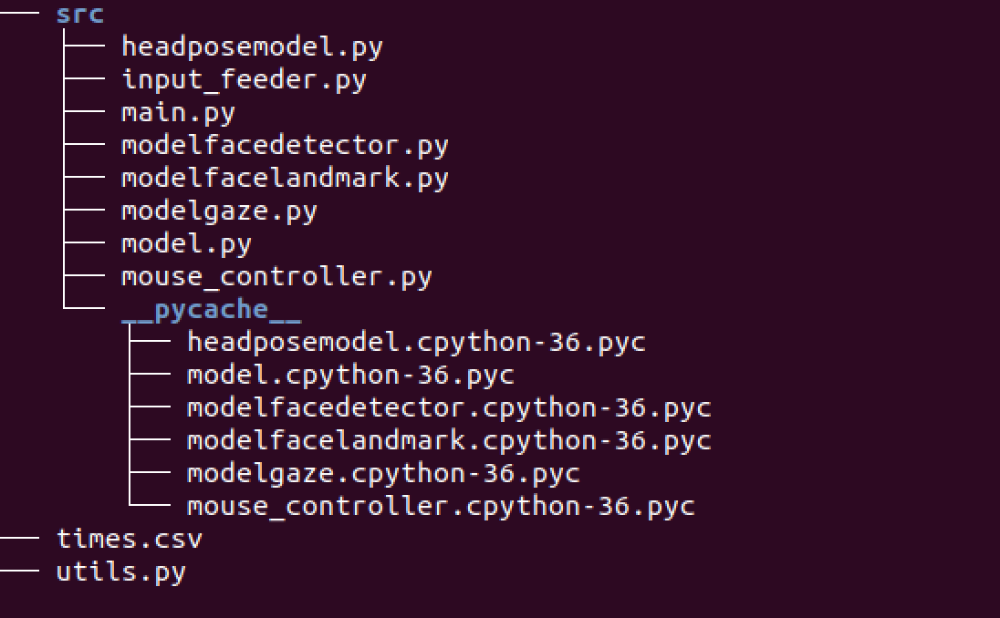

# Computer Pointer Controller
In this project three different models were used from OpenVINO model zoo namely the face detection, Head Pose Estimation and Facial landmark Detection. Using these models it will be possible to control the mouse pointer based on the estimated pose of the head and the direction the eyes are moving into . The application work by uploading a video or using the camera as an input and then it starts moving the pointer controller based on estimated head pose and eyes direction. The following diagram explains the project flow that was followed to run the application and obtain results. 

## Project Set Up and Installation
*TODO:* Explain the setup procedures to run your project. For instance, this can include your project directory structure, the models you need to download and where to place them etc. Also include details about how to install the dependencies your project requires.
In order to view the project strcutre the following screenshot was taken

The project will run by satsifiying the following requirments: 
The OpenVINO toolkit is used to run the application and Intel provides detail documentation about the tool on the website as well as many video on YouTube that are uploaded regularly. Depending on the device being used there is an installation procedure explained on the Intel website . Please click the link below to refer to documentations for each operating system: 
https://docs.openvinotoolkit.org/latest/index.html

In case of my application running I downloaded OpenVINO on a virtualbox that has built in Ubuntu along with OpenCV 3.4 , CMake 2.8 , Python 3.5 and GNU Compiler Collection 3.4. 
Following downloading the  file the steps below were run to complete installation on local machine : 

https://docs.openvinotoolkit.org/latest/openvino_docs_install_guides_installing_openvino_linux.html

Initialize the OpenVINO environment on local machine by typing the following code line 
source /opt/intel/openvino/bin/setupvars.sh 
  
Locate the folder location containing the files in order to run the program . 
The OpenVINO toolkit is used to run the application and Intel provides detail documentation about the tool on the website as well as many video on YouTube that are uploaded regularly. Depending on the device being used there is an installation procedure explained on the Intel website . Please click the link below to refer to documentations for each operating system: 
https://docs.openvinotoolkit.org/latest/index.html

It is important to activate the environment by running 
python3 -m venv <your-env>
Activate it by running:
source your-env/bin/activate
Install required libraries and dependencies provided in requirements.txt:
pip3 install -r requirements.txt

## Demo
To run the program after locating the file and initiating the environment . Please check the screenshoot. 

The following link provided video explains how the demo was run and the result of the application https://1drv.ms/v/s!AvVQna7ygckDhD60OQZeRtbUPjRE

## Documentation
The models used are pre-trained models from the model zoo and each model used for this project has its own documentation which will refer to it in a separate link below 

1.Gaze Estimation Model 
https://docs.openvinotoolkit.org/latest/omz_models_intel_gaze_estimation_adas_0002_description_gaze_estimation_adas_0002.html

2.Head Pose Estimation Model 
https://docs.openvinotoolkit.org/latest/omz_models_intel_head_pose_estimation_adas_0001_description_head_pose_estimation_adas_0001.html

3.Landmark Detection Model 
https://docs.openvinotoolkit.org/latest/omz_models_intel_landmarks_regression_retail_0009_description_landmarks_regression_retail_0009.html

4.Face Detection Model 
https://docs.openvinotoolkit.org/latest/omz_models_intel_face_detection_adas_binary_0001_description_face_detection_adas_binary_0001.html

## Benchmarks and Results 
The results provided for this section of the project is collected based on running multiple model precision on CPU and GPU for an INTEL with CPU I5-6500 results are
recorded as following: 

1. Model Precision : FP32  
   Total inference time in seconds 65  and time for loading the model is 1.7 
2. Model Precision : FP16 
   Total inference time in seconds 79 and time for loading the model is 1.3
   
 On the other hand the following results were obtained for running the model on GPU and are recorded as following: 

1. Model Precision : FP32 
  Total inference time in seconds 67 and time for loading the model is 54 
2. Model Precision : FP16 
  Total inference time in seconds 73 and time for loading the model is 51 
  
Through reading the results above it is clear that it took longer total inference time for both CPU and GPU for a model precision of FP16 while it took less time to load  the model for FP16. Also, based on the results for a model precision of CPU FP32 it has total less inference time in seconds than a GPU with FP32 . However, the model accuracy will decrease as a result of decreasing the precision. The loading time is always less for a model precision of FP16 . 

Finally the following results were obtained for INT8: 

CPU 
Total inference time: 77 Time for loading the model : 1.2 

GPU
Total inference time: 73 Time for loading the model : 50.3 

By anayalising the results obtained for  INT8 it shows that it has less loading time. 
### Edge Cases
Multiple faces detection do not function using the application so if there are many faces in a video the application will only detect one face and will show the result for that particular face . 
